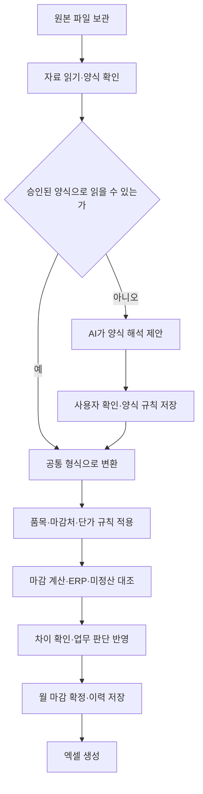

# 촉매 마감 자동화 프로그램 설계

작성일: 2026-10-08  
상태: 합의된 기본 설계에 OpenRouter 연결 및 AI 비용 관리 반영. 프로그램 구현 전 검토 문서.

## 1. 목적과 범위

사용자의 Windows PC에서 혼자 사용하는 프로그램이다. 매월 ERP 입고, 희성촉매·유미코아 자료, 단가, 월계획을 가져와 사업장별 마감과 미정산을 대조하고 엑셀을 생성한다.

원본 자료, 업무 기준, 계산, 보고서를 분리한다. 보고서 양식이 바뀌어도 동일한 마감 데이터를 사용한다. 결과물은 사업장별 마감 내역, 미정산 내역, 종합 요약·그래프, 누적 실적을 포함하는 엑셀이다. PPT 생성, 다중 사용자, 서버 운영, ERP 직접 연결은 이번 범위에 포함하지 않는다.

현재 엑셀은 초기 기준과 이관 자료로 활용한다. 과거 모든 월을 원본과 전수 대조한 데이터라는 의미는 아니다. 초기 이관 기록에 검증 여부와 출처를 남긴다.

## 2. 합의된 사항과 남은 결정

| 항목 | 상태 |
|---|---|
| 본인 PC에서 단독 사용 | 확정 |
| 매월 ERP 입고 기준은 기간별구매거래처입고현황 | 확정 |
| 월품목구매현황은 과거 입고 보충·대조 용도 | 확정, 매월 필수 아님 |
| 단가와 마감처 관리 분리 | 확정 |
| 평균 실적은 마감 수량 기준 | 확정 |
| 결과물은 엑셀까지 | 확정 |
| 월계획의 저장 항목과 연결 기준 | 설계 가능 |
| 월계획 파일의 실제 시트·열·금액 단위 | 원본 수령 후 확인 |
| 촉매와 제품 연결 | BOM 파일 기준. 다른 컴퓨터에서 작업 재개 시 사용자 제공 예정 |
| 희성 배분 수량의 소수점 처리 | 반올림 사용 |
| 희성·유미코아 양식 변화에 AI 활용 | 승인된 양식 재사용, 신규·변경 양식에서만 AI 호출 |
| AI 연결 | OpenRouter API를 기본 연결 방식으로 설계 |
| AI 비용 관리 | 호출별 사용량·비용 기록, 호출 전 예상 비용 확인, 사용자 설정 한도 적용 |
| 구체적인 개발 도구·AI 모델·API 키 및 비용 한도 값 | 구현 계획과 최초 설정 단계에서 결정 |

## 3. 입력 자료의 역할

파일명 날짜와 관계없이 사용자가 대상 월과 자료 종류를 지정한다. 파일 내부의 대상 기간을 확인하고 서로 다르면 확인 대상으로 표시한다.

| 자료 | 현재 예시 파일 | 역할 |
|---|---|---|
| ERP 입고 | 기간별구매거래처입고현황_20261008.xlsx | 품번·거래처별 당월 입고 기준 |
| 희성 원본 출하 | 9월 우신공업 출하실적.xlsx | 희성이 보낸 당월 촉매 출하 자료. 우신 입고에 해당하며 ERP와 대조 |
| 희성 적송재고 | 촉매사가 월 중반 보내는 적송재고(마감이월) 자료 | 전월 마감이월 수량의 출처. 실제 파일 양식은 확인 전 |
| 제품 납품·이동 자료 | 창고별 수불집계조회_20261008.xlsx | ERP의 한 달 제품 수불 자료. 창고별 제품 이동을 촉매 마감처로 연결해 배분 비율 산출. 사용할 수량 열은 확인 중 |
| 반제품 출하 자료 | 창고별 수불집계조회_20261008 (2).xlsx | 당월 당진 대상 반제품의 출고 적송처리 및 예외 출고 이동처리 확인. 기아 화성 배분 근거 |
| 희성 가공 마감 | 9월 우신공업 출하실적_29일 발주 반영_rev2.xlsx | 위 자료를 가공해 작성한 결과. 작성 지원 기능의 비교 기준이며 자동화 후 생성 대상 |
| 유미코아 자료 | 우신공업 9월 한국유미코아촉매_0929_발주 포함 (1).xlsx | 납품·전월 잔여·촉매사 마감 표기 등 수집 |
| 등록 단가 | 구매단가등록_20261008.xlsx | 품번별 전산 등록 단가. 마감처 판단에는 사용하지 않음 |
| 월계획 | 추후 제공 | 대상 월·마감처별 계획 수량과 금액 |
| 초기 마감·누적 | 26년 9월 촉매 마감.xlsx | 기존 확정 실적, 미정산, 수동 판단과 품목 배치 이관 |
| 과거 입고 참고 | 월품목구매현황(단가별)_wooshin_20261008.xlsx | 과거 입고 보충 및 교차 대조. 마감 실적으로 대체하지 않음 |

ERP 입고 자료와 촉매사 자료는 같은 입고를 서로 대조하는 자료다. 두 파일의 수량을 더해서 입고 합계를 만들지 않는다.

희성 출하 원본과 희성 가공 마감 파일의 Sheet2는 현재 비교에서 동일했다. 가공본에는 9월 마감자료와 글로비스 시트가 추가되어 있다. 희성 원본을 읽는 것과 가공 마감 파일을 생성하는 것은 별도 단계다.

제품 수불 자료는 마감 시점에 거래명세표가 전부 발행된 상태가 아닐 수 있다. 거래명세표 발행분만으로 제품 납품 비율을 구하지 않는다. 예시 자료가 월 경과 후 발행된 상태라고 해서 그 상태를 매월 필수 조건으로 삼지 않는다. 파일명 날짜는 조회 대상 월을 뜻하지 않으므로 사용자가 실제 조회 기간을 지정하고 기록한다.

## 4. 프로그램 구성



| 구성 요소 | 책임 | 다음 단계로 넘기는 내용 |
|---|---|---|
| 원본 관리 | 원본 복사, 파일 식별, 대상 월과 버전 관리 | 원본 ID와 파일 정보 |
| 자료 읽기 | 시트·셀·표 영역 추출, 양식 변경 탐지 | 원본 위치를 포함한 표 데이터 |
| AI 양식 해석 | 낯선 표의 열 의미·위치·단위 제안 | 후보 매핑과 근거, 확인 사항 |
| 기준 관리 | 품목, 마감처, 촉매사, 단가, 사급 및 제외 규칙 | 적용 기간에 맞는 기준 |
| 마감 계산 | 수량·금액·미정산·계획 대비·평균 계산 | 공통 마감 데이터 |
| 검증·확정 | 차이와 미해결 항목 확인, 승인, 확정 버전 관리 | 확정된 월별 데이터 |
| 엑셀 출력 | 확정 데이터를 표·그래프로 표시 | 재생성 가능한 보고서 |

저장은 로컬 파일 보관소와 단일 로컬 데이터베이스를 사용하는 안을 제안한다. SQLite 등을 후보로 삼되 구체적 기술 선택은 구현 계획에서 확정한다. AI 해석을 연결하면 해당 기능을 사용할 때 네트워크가 필요하다.

## 5. 공통 데이터 구조

### 5.1 원본과 양식

| 기록 | 주요 항목 |
|---|---|
| 원본 파일 | 원본 ID, 파일명, 파일 해시, 자료 종류, 촉매사, 대상 월, 등록 일시, 버전 |
| 양식 규칙 | 자료 종류, 촉매사, 양식 버전, 시트, 제목 행, 표 영역, 열 의미, 단위, 합계 행 처리, 승인 이력 |
| 원본 행 | 원본 ID, 시트, 행·셀 위치, 원본 품번·거래처·수량·금액·비고 |
| AI 호출 기록 | 호출 ID, 원본 ID, 양식 버전, 호출 사유, 서비스·모델·제공사, 일시, 상태, 입력·출력 토큰, 반환된 추가 과금 토큰 정보, 추정·실제 달러 비용, 환산 가정, 재시도 연결 |

원본과 변환 결과는 함께 보존한다. R600 접두어를 제거해 품번을 비교하는 등 변환 규칙을 명시하고 원래 값도 남긴다. 병합 셀, 다단 제목, 중간 소계, 여러 표가 있는 시트를 처리한다. 소계·전체 합계 행은 품목 수량에 중복 합산하지 않는다.

### 5.2 품목과 마감처

별도 품목 관리표를 만들고 현재 사업장별 시트의 품목 배치를 초기 자료로 삼는다.

- 품번, 촉매사, ERP 거래처 구분, 실제 마감처, 사급 여부, 적용 시작·종료 기간, 제외 여부와 사유, 확인 이력.
- 하나의 품번이 여러 마감처에 사용될 수 있다. 품번 하나에 마감처 하나를 강제로 지정하지 않는다.
- 전산 거래처와 실제 마감처가 다르면 승인된 변환 규칙을 사용한다.
- 신규·미등록 품목, 복수 후보, 규칙이 없는 거래처는 자동 배정하지 않고 확인 대상으로 둔다.
- 과거 파일에서 특정 품목 아래에 있다는 위치는 영구적인 마감처 구분 규칙으로 사용하지 않는다.

희성 배분의 촉매와 컨버터(제품) 연결은 BOM 파일을 기준으로 한다. 사용자가 다른 컴퓨터에서 작업을 시작할 때 해당 파일을 제공하기로 했다. 하나의 촉매가 들어가는 제품들과 납품처를 연결하고 적용 기간을 남긴다. 제품별 촉매 사용 개수와 제품 품번 묶음은 실제 BOM 구조를 확인해 적용한다. 제품 수량과 촉매 수량을 항상 1:1로 가정하지 않는다.

제품 수불의 창고명과 촉매 마감처는 별도로 저장한다. 창고·제품 조건·적용 기간을 기준으로 마감처를 연결하는 관리표를 두고 원래 창고명도 보존한다. 확인된 예시는 `세종공업(화성) → 현대 울산`이다. 컨버터가 세종공업에서 머플러로 조립되어 최종적으로 현대 울산에 납품되는 흐름에 따른 구분이다. 중간 납품처 이름만 보고 촉매 마감처를 세종공업으로 정하지 않는다. 다른 창고나 예외 제품은 해당 규칙을 확인해 추가한다.

사용자가 확인한 당진 경로는 `H28950-…`, `H289G0-…` 반제품 → 당진공장 머플러 조립 → 기아 화성이다. 제품만 조회한 수불 자료에는 없으므로 반제품 자료를 별도로 받거나 품목자산분류를 포함한 통합 자료에서 구분한다. H로 시작하는 모든 품번을 당진·화성으로 지정하지 않는다. 실제 적용은 BOM 및 경로 관리표의 대상 품목과 연결한다.

### 5.3 단가

등록 단가와 실제 적용 단가를 구분한다.

- 품번, 등록 단가, 적용 단가, 정단가/가단가 구분, 적용 기간, 필요한 경우 촉매사·마감처 조건, 적용 근거와 사용자 확인.
- 1원인 등록 단가와 승인된 가단가가 다를 수 있다. 차이가 있다고 무조건 등록 단가로 덮어쓰지 않는다.
- 같은 품번의 등록 단가가 중복되고 서로 다르면 원본의 두 후보를 보존하고 적용 근거를 확인한다.
- 새 등록 단가 파일로 과거 확정 마감 금액을 다시 계산하지 않는다.

### 5.4 월별 거래·마감

기본 구분은 대상 월·마감처·품번·촉매사이며, 같은 구분 안에서도 단가가 다르면 별도 명세로 유지한다.

| 항목 | 의미 |
|---|---|
| ERP 입고 수량 | 전산 자료의 당월 입고 기준값 |
| 촉매사 납품 수량 | 촉매사 자료에서 읽은 납품 값 |
| 촉매사 마감 표기 수량 | 원자료에 마감으로 표시된 값 |
| 실제 마감 수량 | 업무 규칙과 사용자 확인을 반영한 마감 값 |
| 희성 마감 기준 수량 | 기본적으로 전월 마감이월 + 당월 희성 촉매 출하. 예외 적용 전의 배분 기준 |
| 제품 납품·배분 근거 | 해당 촉매 관련 제품의 마감처별 납품 수량, 집계 대상, 배분 비율, 자료 출처 |
| 전월 미정산 | 이전 확정 월의 이월 수량 |
| 당월 말 미정산 | 다음 달로 넘길 미정산 수량 |
| 적용 단가·구분 | 실제 적용 단가 및 정/가 구분 |
| 마감 금액 | 실제 마감 명세별 수량 × 적용 단가의 합 |
| 미정산 금액 | 미정산 명세별 수량 × 적용 단가의 합 |
| 조정 내역 | 반품·정정 등 확인된 조정 수량, 근거와 사유 |
| 특이사항 | 미마감 사유, 예정 월, 업무 판단과 확인 상태 |
| 출처 | 각 값의 원본 파일·시트·셀 또는 수동 확인 기록 |

빈칸과 실제 0을 구분한다. 수량과 금액의 원본 단위를 보존하고 보고서 표시 단계에서만 천원 등으로 바꾼다. 계산은 십진수 기준으로 처리하며, 단가와 계획 금액의 소수 정밀도 및 원 단위 반올림은 원본 기준을 확인해 적용한다.

### 5.5 계획과 확정 이력

월계획은 대상 월·마감처별 계획 수량과 금액을 저장한다. 품번별 계획이 제공되면 품번별 명세를 보존하고 마감처로 합산한다. 파일의 실제 열 매핑과 금액 단위는 수령 후 확인한다.

마감 상태는 작업 중 → 확인 필요 → 확정으로 관리한다. 확정 후 수정은 새 버전으로 저장하고 변경 전 값·변경 후 값·사유·일시를 남긴다. 엑셀에는 확정 버전을 연결한다.

## 6. 업무 규칙

1. 입고와 마감은 별도 지표다. 평균 실적 수량은 마감 수량을 사용한다.
2. 기본 수량 검증은 `전월 미정산 + 당월 입고 - 실제 마감 = 당월 말 미정산`이다. 확인된 조정이 있을 때만 별도 명세를 반영한다. 차이를 없애려고 자동 조정값을 만들지 않는다.
3. 촉매사 자료의 마감 표기가 실제 정산을 보장하지 않는다. 유미코아 미마감 등 월별 확인 사항을 실제 마감 값에 반영한다.
4. 글로비스 사급 품목은 제품의 글로비스 입고 여부에 따른 정산 조건을 적용한다. ERP 촉매 입고만으로 제품 입고를 추정하지 않는다. 제품 입고 확인 자료가 없으면 사용자가 확인한 정산 수량·사유를 기록한다.
5. `289E0-4A120`, `289E0-4A720`은 촉매 집계에서 제외한다. 보고서에 별도 제외 설명을 넣을 필요는 없다. 내부 규칙에는 사유를 남긴다. 이 제외는 촉매 집계에 적용한다. 제품 수불 자료에 있는 관련 컨버터 품번까지 자동 삭제하지 않는다. 제품과 촉매를 연결하고 배분 근거를 계산할 때 필요한 제품 데이터는 별도로 보존한다.
6. `28957-2JDF0`의 기존 131,518원은 사용자가 설정한 가단가다. 등록 단가 1원과 다른 것이 오류라는 전제를 두지 않는다. 미래 월의 적용은 해당 월에 유효한 승인 기준을 따른다.
7. 유미코아 자료의 고객사 표기와 실제 마감처가 다를 수 있다. 현재 확인된 모비스·위아·전주 구분을 초기 관리표로 옮기되 품목별로 기록한다.
8. 과거 평균의 초기 기준은 현재 엑셀과 같이 보고 월 직전 3·6·12개월이다. 2026년 9월이면 6~8월, 3~8월, 2025년 9월~2026년 8월이다. 누락 월을 0으로 간주하지 않는다.
9. 월계획 원본이 없으면 실적 마감과 엑셀 생성은 가능하다. 계획과 달성률은 확인되지 않은 값임을 표시한다. 초기 엑셀에 저장된 계획값의 출처도 별도 구분한다.

### 6.1 희성촉매 마감 파일 작성 규칙

사용자가 설명한 현재 업무 기준은 다음과 같다.

1. 월 중반 촉매사가 보내는 적송재고(마감이월) 자료에서 전월 마감이월 수량을 가져온다. 이전에 확정한 자체 이월과 차이가 있으면 표시하고 확인한다. 임의로 한쪽을 덮어쓰지 않는다.
2. 희성의 당월 촉매 출하 수량을 가져온다. 이는 우신에 입고된 수량에 해당하며 ERP 입고 기준과 대조한다.
3. 기본 마감 기준 수량은 `전월 마감이월 + 당월 촉매 출하`다. 제품 납품 합계를 이 수량 대신 사용하거나 재공품 추정량을 임의로 빼지 않는다.
4. 마감처가 한 곳이면 그곳으로 귀속한다. 다만 미마감 등 확인된 예외 조건은 적용한다.
5. 마감처가 여러 곳이면 해당 촉매가 들어가는 제품의 마감처별 납품 수량으로 비율을 구하고, 기본 마감 기준 수량을 그 비율로 배분한다. 회사 전체 제품 납품 비율을 모든 촉매에 공통 적용하지 않는다.
6. 기본 배분식은 `해당 촉매의 마감 기준 수량 × 해당 마감처의 관련 제품 당월 이동 비율`이다. 비율에는 전월 제품 마감이월을 제외한 당월 이동 수량을 사용한다. 촉매 마감 기준 수량에 전월 촉매 마감이월을 더하는 규칙과 구분한다. ERP 창고별 수불집계조회에서 제품 수량을 가져오고 창고와 촉매 마감처 변환을 거친다. 제품 연결 및 사용 개수 적용과 다른 창고의 세부 수량 열은 실제 자료와 업무 기준을 확인해 확정한다.
7. 사용자의 지시에 따라 배분 수량은 정수로 반올림한다(양수의 0.5는 올림). 반올림으로 생긴 합계 차이만 조정 가능한 마감처 중 배분 수량이 큰 순서로 가감해 배분 대상 총수량과 맞춘다. 동률이면 관리표의 마감처 순서를 사용하고 조정 내역을 남긴다. 조정으로 음수 수량을 만들지 않으며 글로비스의 실제 입고로 확정된 수량은 조정 대상에서 제외한다. 글로비스 미입고 등 업무상 미마감 차이는 반올림 잔여로 간주해 다른 마감처에 넘기지 않는다. 제품 납품 합계가 0인 경우 비율을 만들지 않고 확인 대상으로 둔다.
8. 글로비스는 기본 배분만으로 마감 수량을 확정하지 않는다. 글로비스에 제품이 실제 입고된 수량에 근거해 관련 촉매를 마감한다. 제품과 촉매의 연결을 거쳐 수량을 확인한다.
9. 글로비스를 비율 집계에 포함하는지, 그 정산 수량을 먼저 확정한 뒤 나머지를 배분하는지, 미마감 잔여를 어떻게 이월하는지는 확인 후 절차를 확정한다. 글로비스 미마감 잔여를 다른 마감처에 임의로 재배분하지 않는다.
10. 위 배분을 거친 실제 마감 합계와 기본 마감 기준 수량의 차이를 이월·미마감 내역으로 연결하고 사유를 남긴다. 마감이월을 실제 창고·재공 재고와 동일한 개념으로 취급하지 않는다.

제품 수불 예시의 주요 열은 B열 창고, D열 제품 품번, E열 이월수량, F열 입고수량, G열 출고수량, H열 재고수량, J열 입고 이동처리, M열 출고 거래명세표, N열 출고 이동처리, O열 출고 적송처리다. 단순히 모든 입출고 수량을 더하면 같은 제품 이동을 중복 계산할 수 있으므로 배분에 사용할 기준 열을 업무 확인 후 지정한다. 재고 H열과 전월 이월 E열을 당월 납품 수량으로 간주하지 않는다. 음수·반품·재이동은 임의로 0으로 바꾸지 않고 원본과 처리 근거를 남긴다.

확인된 사례는 `M28950-2JAV0 / 세종공업(화성)`이다. 예시 파일 Sheet1의 J100(입고 이동처리)은 8,400개, N100(출고 이동처리)은 8,880개다. 사용자는 그 차이 480개가 전월에 제품 마감이 되지 않아 이월된 제품 수량이라고 설명했고, 배분 비율에는 당월 이동 8,400개를 사용한다고 확인했다. 이 사례는 J열 값을 현대 울산으로 귀속하고 비율에 사용한다. 제품 마감이월과 촉매 마감이월은 구분해서 저장한다. 다른 창고도 당월 이동을 사용하되 해당 흐름이 어느 열에 나타나는지 별도로 검증한다. 모든 창고에 J열을 무조건 적용하지 않는다.

### 6.2 유미코아 처리 구분

유미코아는 현재 제공된 우신공업 9월 한국유미코아촉매_0929_발주 포함 (1).xlsx에 정리된 양식을 활용한다. 희성과 같은 제품 납품 비율 배분 과정을 일괄 적용하지 않는다.

기존 양식에서 납품·이월·마감 표기와 고객사 구분을 추출한 뒤 실제 마감 여부, 마감처 변환, 단가와 ERP를 검증한다. 자료에 마감으로 표시되어도 실제 미마감인 품목은 사용자 확인 규칙을 적용한다. 양식 변화에 대한 AI 해석은 양사에 사용할 수 있지만 마감 계산 규칙은 촉매사별로 구분한다.

### 6.3 당진 반제품 → 기아 화성 경로

1. 대상은 BOM과 경로 관리표로 확인한 `H28950-…`, `H289G0-…` 반제품이다. ERP 품목자산분류가 반제품인지도 확인하고 당진으로 가는 경로를 기아 화성 마감처와 연결한다.
2. 반제품 수불 예시의 창고는 주로 원자재(창고+라인)로 표시되며 당진이라는 목적지 표기가 없다. 파일의 창고명만으로 목적지를 증명할 수 없으므로 사용자 확인 경로를 기준으로 한다. 미등록 품목이나 경로가 달라진 품목은 확인 대상으로 둔다.
3. 기아 화성의 배분 근거로 사용할 당월 당진 출하 수량은 출고의 적송처리를 기본으로 한다. 확인된 예시 `H28950-08440`은 생산입고 4,130개가 아니라 출고 적송처리 4,200개다. 반제품이 당월 실제 출하된 수량에는 이전에 생산된 반제품이 포함될 수 있으며, 당월 생산량을 출하량 대신 사용하지 않는다.
4. 사용자는 가끔 적송처리 대신 이동처리로 입력하는 실수가 있다고 설명했다. 따라서 출고의 이동처리도 확인 대상이다. 적송이 0일 때만 이동을 보는 방식으로 처리하지 않고 두 항목이 함께 존재하는 경우도 살핀다.
5. 이동처리 수량이 있으면 적송 수량과 이동 수량을 따로 표시한다. 해당 이동이 당진 출하라는 확인이 되면 `출고 적송처리 + 확인된 당진 출고 이동처리`를 배분 근거로 사용한다. 다른 목적지 이동은 제외하며 확인하지 않은 이동을 임의로 당진에 포함하지 않는다. 반복적으로 확인한 처리 경로는 적용 기간과 함께 관리표에 저장할 수 있다.
6. 제품 자료와 반제품 자료의 열 위치는 다르다. 반제품 예시에서는 품목자산분류 A, 창고 B, 품번 D, 출고수량 G, 출고 적송처리 L이다. 현재 예시에는 출고 이동처리 열이 없다. 다른 월에는 생길 수 있으므로 상위 제목(입고/출고)과 하위 제목(적송처리/이동처리)을 함께 읽어 의미로 매핑한다. 입고 이동처리나 생산입고를 대신 더하지 않는다.
7. 출고 이동처리 열이 없다면 그 항목이 제공되지 않았음을 기록한다. 적송 수량은 사용할 수 있지만 이동 예외의 완전성까지 검증했다는 뜻은 아니다. 양식에 열이 새로 생기면 감지하며 기존 숫자 열 위치를 그대로 적용하지 않는다.
8. 반제품의 출고수량 합계와 유형별 출고를 대조해 중복·누락을 확인한다. 같은 출하가 적송과 이동에 중복 반영되었다는 근거가 있으면 두 번 더하지 않고 원본을 확인한다. 집계 자료만으로 구분되지 않으면 상세 전표 또는 사용자 확인을 남긴다.
9. 같은 촉매 흐름에 당진 반제품 출하와 이후 제품 납품을 함께 합산해 중복 배분하지 않는다. 경로별로 사용하는 집계 지점을 관리한다. 당진 경로는 반제품 출하를 근거로 하고, 관련 촉매는 BOM으로 연결한다.
10. 반제품 자료가 없으면 당진 대상 품목을 0개로 처리하지 않는다. 당진 출하 자료 누락을 표시하고 필요한 자료 또는 근거가 있는 수동 수량을 확인한다.

## 7. AI 연결과 양식 해석

### 7.1 권장 역할

AI는 희성·유미코아 파일에서 시트, 제목, 표 영역, 열 의미, 단위, 비고의 의미를 찾아 양식 매핑을 제안한다. 프로그램은 그 위치의 실제 셀 값을 읽고 계산한다.

예를 들어 유미코아 파일의 ‘당월 납품’ 열이 K열에서 다른 열로 이동하거나 제목이 두 줄로 바뀌면 AI가 새로운 위치와 근거를 제시한다. 수량의 의미가 납품인지 마감인지 불명확하면 질문을 생성한다.

AI가 합계 숫자를 만들어 내거나, 불일치를 임의로 정정하거나, 승인된 가단가와 마감처를 바꾸거나, 월 마감을 확정하는 기능은 두지 않는다. 파일의 비고·문구는 분석 대상 자료로 취급하고 프로그램에 대한 실행 지시로 취급하지 않는다.

### 7.2 연결 방식과 설정

| 방식 | 사용 방법 | 특징 |
|---|---|---|
| OpenRouter API 연결 | 프로그램에서 선택한 모델에 양식 해석 요청 | 기본 연결 방식. OpenRouter API 키 사용 |
| OpenAI API 직접 연결 | 동일한 내부 해석 인터페이스에 별도 연결 구현 | 향후 선택지. 1차 구현의 필수 항목은 아님 |
| ChatGPT/Codex에서 수동 해석 | 사용자가 파일 또는 필요한 영역을 분석시킨 뒤 매핑 결과를 가져오기 | 초기 양식 등록과 예외 처리에 활용 가능. 직접 전달 단계 필요 |
| 고정 양식만 사용 | 승인된 시트·열 규칙으로 읽기 | 기존 양식 처리에 적합. 양식이 바뀌면 새 매핑 필요 |

고정 양식 규칙을 우선 사용하고 변경 감지 시 OpenRouter에 해석을 요청한다. 이 채팅이 프로그램 내부에서 자동으로 이어지는 것으로 가정하지 않는다. 자료 읽기·계산은 로컬에서 수행하고 AI 연결 부분만 교체할 수 있도록 한다.

설정 화면에는 다음 항목을 둔다.

- 연결 서비스: 기본 OpenRouter.
- API 기본 주소: `https://openrouter.ai/api/v1`.
- OpenRouter API 키: 별도 자격 증명 저장소에 보관하고 설계 문서·일반 설정 파일·엑셀·로그에 노출하지 않는다.
- 모델 ID 및 제공사 선택: Structured Outputs 지원을 확인한 조합을 사용한다. 가격·지원 여부를 확인하지 않은 모델로 자동 전환하지 않는다.
- 입력·출력 토큰 한도, 호출당 비용 한도, 월별 비용 한도, 원화 예상 표시용 환율.
- 모델별 입력·출력 단가와 확인 일시: 호출 전 견적 및 비용 한도 계산에 사용한다.

OpenRouter 요청은 `response_format.type = json_schema`를 사용하고 `provider.require_parameters = true`로 필요한 파라미터를 지원하는 제공사에 제한한다. 가능한 경우 `strict: true`를 사용하지만 제공사별 준수 수준이 다르므로 프로그램에서도 응답 구조와 내용·원본 위치를 검증한다.

### 7.3 API 요청과 결과

프로그램이 로컬에서 시트명, 제목·표 구조, 셀 주소가 붙은 필요한 영역을 추출한다. 가능한 한 양식 판단에 필요한 범위만 전송하고, 승인된 매핑으로 전체 데이터를 로컬에서 추출한다. 필요한 이미지 영역이 있다면 별도 입력 방식을 검토한다. 이 문서 작성 중 실제 업무 자료를 API에 전송하지 않았다.

OpenRouter의 Structured Outputs를 지원하는 모델·제공사로 결과를 정해진 JSON 구조로 받는다. 출력 구조의 지원·강제 수준은 제공사에 따라 다르며 내용의 정확성까지 보장하지 않는다. 형식 검증 후 원본 셀 위치와 추출 결과도 대조한다.

결과 항목은 촉매사, 대상 월 후보, 시트·표 영역, 제목 행, 품번 열, 거래처 열, 납품 열, 마감 열, 전월 이월 열, 미정산 열, 금액 단위, 제외할 합계 행, 원본 근거, 불명확한 항목으로 구성한다. 없는 항목은 없음을 표시하고 임의로 추정하지 않는다.

Function calling은 추후 AI가 프로그램의 제한된 자료 조회 기능을 요청해야 할 때 선택할 수 있다. 1차 설계에는 구조화된 매핑 응답만으로도 충분하므로 복잡한 에이전트나 자유로운 파일 수정 권한을 전제로 하지 않는다.

### 7.4 변경 감지와 승인

- 촉매사별 시트, 제목, 열의 구성과 승인된 양식 버전을 비교한다.
- 기존 양식으로 읽히더라도 매월 필수 항목, 행 처리 범위, 합계와 ERP를 검증한다.
- 신규·변경 양식은 원본 미리보기와 해석 결과를 나란히 보여주고 사용자가 승인한다.
- AI의 자신감 점수만으로 자동 승인하지 않는다. 원본 위치, 행 누락·중복, 합계 일치가 기준이다.
- 승인한 양식 규칙을 버전으로 저장해 다음 달 재사용한다. 사용자의 정정을 모델이 자동 학습한다고 표현하지 않는다.
- 통신 실패, 해석 불완전, 출력 형식 오류는 데이터 저장 전 중단한다. 기존 승인 매핑이나 수동 열 선택으로 복구하며 실패를 0건·0원으로 대체하지 않는다.

### 7.5 AI 호출을 줄이는 규칙

1. 승인된 양식이 없는 촉매사 자료를 처음 등록하거나, 기존 양식 규칙으로 해석할 수 없는 구조 변화가 있을 때 AI를 호출한다.
2. 양식은 시트·제목·열 의미·병합 구조·표 구분 등으로 식별한다. 월, 납품 수량, 품목 행 수가 바뀌었다는 이유만으로 AI를 호출하지 않는다. 새 표나 해석 불가능한 열 의미가 생기면 변경으로 처리한다.
3. 재사용하는 것은 열·표 해석 규칙이다. 지난달 수량이나 금액을 캐시에서 재사용하지 않고 이번 파일의 셀 값을 새로 읽는다.
4. 같은 원본·같은 해석 설정·같은 양식 해석 요청의 승인 결과는 재사용한다. 실패하거나 승인되지 않은 결과는 재사용 가능한 규칙으로 취급하지 않는다.
5. 같은 양식의 매월 파일 처리, 합계·평균 계산, 동일한 확정 데이터의 엑셀 재생성에는 AI를 호출하지 않는다. 따라서 이 작업들은 AI 토큰 비용이 발생하지 않는다.
6. 새로운 업무 판단이나 단순 수량 불일치는 우선 업무 규칙과 사용자 확인으로 처리한다. 불일치만을 이유로 반복 AI 호출하지 않는다.
7. 사용자가 AI 재해석을 요청할 때는 기존 해석 상태와 예상 비용을 보여주고 재호출한다.

### 7.6 예상 토큰 비용

아래는 2026-10-08 확인한 OpenRouter 모델 가격을 이용한 예시다. 현재 업무 파일의 실제 사용량을 측정한 견적이나 모델 성능 검증 결과는 아니다. 모델 선택은 실제 양식 해석 정확도와 지원 제공사를 확인한 뒤 결정한다.

가정: 파일 하나의 양식 해석 요청 전체가 입력 10,000토큰, 응답 2,000토큰이고, 원화 표시를 위해 1달러 = 1,400원을 가정한다. 입력에는 표 영역뿐 아니라 지시문과 요청에 포함되는 설명도 포함한다. 캐시 할인, 이미지·추가 추론 비용은 이 예시에 포함하지 않는다.

| 모델 예시 | 입력 100만 토큰당 | 출력 100만 토큰당 | 파일 1개 | 희성·유미코아 각 1개 |
|---|---:|---:|---:|---:|
| GPT-4.1 Mini | $0.40 | $1.60 | $0.0072, 약 10원 | $0.0144, 약 20원 |
| GPT-4.1 | $2.00 | $8.00 | $0.036, 약 50원 | $0.072, 약 101원 |

토큰 비용 계산식은 `입력 토큰 / 1,000,000 × 입력 단가 + 출력 토큰 / 1,000,000 × 출력 단가`다. 같은 입력량이라도 선택 모델·제공사, 재시도, 추가 과금 항목에 따라 실제 비용이 달라진다. 두 파일의 요청량이 각각 위 가정의 5배이면 토큰 비용도 약 5배가 된다.

위 표는 추론 토큰 비용 예시다. OpenRouter Standard의 플랫폼 수수료 5.5% 등 결제 관련 비용은 별도이며, 추론 사용량과 충전·결제 비용을 구분해 표시한다. 환율은 실제 결제 환율이라는 의미가 아니다. 가격이 변경될 수 있으므로 예시 금액을 프로그램의 영구 고정값으로 사용하지 않는다.

### 7.7 비용 한도·사용량 화면·실패 처리

- 호출 전에 선택 모델·제공사, 호출 사유, 입력 토큰 예상량, 출력 토큰 상한, 예상 달러 비용과 원화 환산값을 표시한다. 정확한 토큰 계산을 지원하지 않는 모델은 추정임을 명시한다.
- 알려진 단가와 출력 상한 등을 이용한 예상 비용을 호출당·월별 한도와 비교한다. 한도 초과 또는 비용 산정 근거가 없는 요청은 자동 실행하지 않고 수동 매핑으로 전환하거나 사용자에게 비용 설정 확인을 요청한다.
- 입력 영역이 토큰 한도를 넘으면 필요한 영역을 사용자가 확인하도록 한다. 중요한 행을 조용히 잘라 보내거나 여러 유료 호출로 자동 분할하지 않는다.
- 오류 시 자동 재시도는 최초 호출 외 최대 1회로 제한하고, 재시도도 예산을 확인한다. 재시도 실패 시 수동 매핑으로 전환한다. 응답 불완전·통신 시간 초과가 무료였다고 가정하지 않는다.
- API가 반환하는 사용량 및 비용 정보를 우선 저장한다. 제공되지 않으면 설정 단가로 계산한 추정치로 표시하고 실제 청구 비용이라고 표현하지 않는다. 추가 과금 토큰 정보가 있으면 계산에 반영한다.
- 응답을 받지 못해 비용이 불명확한 호출은 비용 확인 필요로 기록한다. 확인되지 않은 비용을 0으로 처리해 남은 한도를 과대 계산하지 않는다.
- 화면에 이번 작업의 호출 횟수, 입력·출력 토큰, 비용, 월 누적, 남은 예산을 표시한다. API 키를 표시하거나 사용량 로그에 기록하지 않는다.
- 비용 화면의 원화 금액은 설정 환율을 이용한 참고값이다. 충전·결제 수수료와 세금 등은 별도 항목으로 설명하며 동일 비용을 중복 합산하지 않는다.

## 8. 사용자 화면

1. 대상 월 선택: 필요한 자료와 등록 상태를 표시한다.
2. 자료 넣기: 자료 종류별 파일을 지정한다. 파일명만으로 촉매사나 대상 월을 확정하지 않는다.
3. 양식 확인: 기존 양식은 검증 결과를 보여주고 새 양식은 AI 호출 사유·예상 비용 및 반환된 매핑을 확인한다.
4. 차이 확인: 맞지 않는 품목, 관련 원본 위치, 현재 값과 후보 값, 사유를 표시한다.
5. 업무 판단: 실제 미마감, 가단가, 마감처와 조정 사유를 입력·확인한다.
6. 마감 확정: 미해결 항목을 확인하고 확정 버전을 저장한다.
7. 엑셀 생성: 동일한 확정 버전으로 반복 생성한다.

질문과 확인은 품목 또는 사유별로 한 건씩 진행할 수 있게 한다. 기존 사용자 판단은 파일을 다시 넣어도 보존하되 새 자료와 충돌하면 재확인을 요청한다.

설정·사용량 화면에서는 OpenRouter 연결 상태, 모델·제공사, 비용 한도와 월 누적을 확인한다. AI를 사용하지 않은 엑셀 재생성에는 호출 0회·AI 비용 0으로 표시한다.

## 9. 검증과 출력

검증 항목은 ERP와 촉매사 납품 대조, 전월 이월 연결, 마감·미정산 수량 균형, 단가 적용 근거, 명세 금액과 합계, 마감처별 합계와 전체 합계, 누적 실적과 해당 월 확정값 일치다.

동일한 파일 해시를 다시 등록하면 중복 집계하지 않는다. 다른 수정본은 이전 버전을 대체하는 후보로 취급하고 처리 내역을 비교한다. 실제 마감 명세는 필요한 키와 단가별로 관리해 단순 품번 중복 제거로 거래를 누락시키지 않는다.

엑셀은 하나의 확정 데이터에서 사업장별 내역, 미정산, 종합 표·그래프, 누적 실적을 생성한다. 각각 따로 수기 입력한 합계를 사용하지 않는다. 계획 달성률은 계획이 확인되고 분모가 유효할 때 계산하며, 계획 0과 누락은 구분한다.

확정 및 이력 저장은 함께 완료되도록 처리한다. 저장·엑셀 생성 실패 시 기존 확정 결과를 보존한다. 원본과 데이터베이스는 복구 가능한 백업 대상으로 둔다.

## 10. 구현 완료 판단 기준

- 현재 희성·유미코아 자료를 승인된 원본 위치에서 읽고 품목을 누락·중복 합산하지 않는다.
- 열 순서 변경, 제목 변경, 병합 셀과 소계 추가를 감지하고 새 매핑 확인으로 처리한다.
- ERP 입고와 촉매사 자료의 차이가 품번·마감처별로 표시된다.
- 원자료의 마감 표기와 실제 미마감을 별도로 유지한다.
- 가단가와 등록 단가 차이를 승인 근거에 따라 처리하고 과거 확정 금액을 보존한다.
- 마감처가 복수이거나 신규 품목인 경우 임의 배정하지 않는다.
- 파일 재등록으로 합계가 증가하지 않고 수정본에 대한 기존 판단·변경 이력을 유지한다.
- 8월·9월 누적 누락과 같은 누락 월을 감지하며 입고 실적으로 마감 실적을 대체하지 않는다.
- 사업장별 합계, 종합, 그래프, 누적이 동일한 확정 데이터와 일치한다.
- 월계획 미제공과 실제 0계획을 구분하고, AI 실패 상태에서도 기존 확정 데이터를 훼손하지 않는다.
- 현재 점검된 결과를 초기 비교 기준으로 사용하되 과거 전체 실적의 검증 완료로 확대 해석하지 않는다.
- 동일한 승인 양식의 수량·월 변경 및 엑셀 재생성에는 AI 호출이 발생하지 않는다. 신규·변경 양식에서만 해석 요청한다.
- OpenRouter의 응답을 구조·원본 위치 기준으로 검증하고 API 키가 출력 파일·일반 로그에 남지 않는다.
- 요청 전 견적, 호출당·월별 한도, 재시도 상한, 실제 사용량과 추정 비용의 구분을 확인한다. 한도 초과 및 AI 실패는 수동 매핑으로 복구 가능하다.

## 11. 구현 순서와 현재 우선 과제

설계 다음 단계는 구현 계획 작성이다. 개발할 항목, 입력과 출력, 검증 기준을 작업 단위로 정한다. 이 문서는 구현 코드를 생성하거나 API 연결을 실행한 결과가 아니다.

### 11.1 먼저 확인할 과제: 희성촉매 마감 파일 작성 개선

사용자는 희성촉매 마감 파일을 작성하는 과정이 번거로워 이를 먼저 쉽게 만들기를 요청했다. 희성 원본 출하 자료에 전월 마감이월을 더하고, 여러 마감처가 있으면 관련 제품 납품 비율로 수량을 배분해 가공 마감 자료를 작성한다. 글로비스는 실제 제품 입고에 따른 정산 예외다. 세부 규칙은 6.1절에 기록한다.

현재 희성 파일이 입력 자료라는 점과 별도로, 그 입력 자료를 작성하는 과정 자체가 개선 대상이다. 기존 파일을 읽는 기능만 만들고 이 요청을 해결했다고 보지 않는다.

제품 납품 자료 출처는 ERP 창고별 수불집계조회로 확인했다. 배분에는 전월 제품 마감이월을 제외한 당월 이동 수량을 사용하며, 세종공업(화성)의 확인 사례는 J열 8,400개다. 당월 당진 반제품 출하는 별도 반제품 수불 자료의 출고 적송처리를 사용하고, 실수로 입력된 출고 이동처리는 확인 후 합산한다. 촉매와 제품의 연결은 BOM 기준이고 다른 컴퓨터에서 파일을 받으면 실제 구조를 확인한다. 배분 수량의 소수점 처리는 반올림으로 정했다. 남은 확인 사항은 창고와 마감처의 전체 변환표, 다른 창고의 당월 이동 열, 적송재고 파일 양식 및 글로비스 처리 순서다. 작성 결과는 이후 전체 마감 프로그램이 읽는 희성 가공 마감 자료로 연결한다. 기존 양식 유지 여부 등 구체적인 출력 형식은 범위를 정할 때 확정한다.

### 11.2 전체 프로그램 구현 순서

| 순서 | 작업 | 완료 기준 |
|---|---|---|
| 1 | 품목 관리표 정리 | 품번·촉매사·ERP 거래처·실제 마감처·사급·제외·단가 적용 기준과 기간을 분리하고 미확인 항목을 표시 |
| 2 | 파일 읽기 개발 | ERP·희성·유미코아 자료를 원본 위치가 있는 공통 형식으로 변환하고 누락·소계 중복을 검증 |
| 3 | 계산·검증 개발 | 기존 2026년 9월 마감과 실제 마감 수량·금액·미정산을 대조하고 차이가 있으면 근거를 확인 |
| 4 | 엑셀 출력 개발 | 동일한 확정 데이터로 사업장별 내역·미정산·종합·그래프·누적을 생성하고 합계를 검증 |
| 5 | OpenRouter 연결과 사용 화면 추가 | 신규·변경 양식의 해석·확인, 비용 한도·사용량, 월 마감 확정 흐름을 연결 |

희성 작성 개선은 11.1의 업무 파악을 우선 진행하고, 그 범위를 정한 뒤 위 순서와 연결되는 별도 작업으로 계획한다. 기존 양식 읽기와 계산 검증을 먼저 안정화하고 AI 연결을 추가한다. 전체 데이터 구조에서는 처음부터 양식 버전·원본 근거·AI 호출 기록을 고려한다.

월계획 파일 없이도 품목 관리표 및 ERP·촉매사 자료 처리부터 진행할 수 있다. 월계획 원본이 들어오면 시트·열·단위 매핑과 계획 대비 계산을 추가한다. 모델·제공사 및 사용자 비용 한도는 실제 자료를 이용한 검증과 설정 단계에서 결정한다.

### 11.3 다음 컴퓨터에서 이어갈 상태

- 전체 마감 자동화의 기본 설계와 OpenRouter 비용 관리까지 문서화했다. 프로그램 구현은 시작하지 않았다.
- 현재 우선 과제는 희성촉매 마감 파일 작성 지원이다. 기본 마감 기준 수량, 제품 당월 이동 비율 배분, ERP 제품 수불 자료 출처와 세종공업(화성) → 현대 울산 구분을 확인했다. 예시 제품의 입고 이동과 출고 이동 차이 480개는 전월 제품 마감이월이며 배분 비율에서 제외한다. 당월 이동 8,400개를 사용한다고 확인했다. 촉매와 제품의 연결은 BOM 파일 기준이며 다른 컴퓨터에서 제공 예정이다. 배분 수량은 반올림한다.
- 당진 → 기아 화성 경로에는 H28950- 및 H289G0- 반제품이 있다. 반제품 수불 예시를 받았고 출고 적송처리가 기준이라고 확인했다. 출고 이동처리로 잘못 처리되는 경우도 있으므로 확인 후 포함한다. 세부 기준은 6.3절에 기록했다.
- 4월 실적 불일치 수정, 8·9월 누적 채우기, 정산 단가 대조와 가단가 차이 확인은 현재 PC의 엑셀에서 진행했다. 과거 전체 월의 전수 검증 완료를 의미하지 않는다.
- 월계획 원본의 실제 양식은 아직 확인하지 않았다.
- 검토 폴더의 7개 엑셀과 상위 폴더의 희성 출하 원본을 전체 검토했다. 상세 결과와 이관 주의 사항은 14장에 연결한다. 기존 업무 엑셀은 이번 검토에서 수정하지 않았다.
- 기존 사용자 판단을 유지한다: 평균은 마감 수량, ERP 비교는 기간별구매거래처입고현황, 단가 파일은 마감처 판단에 사용하지 않음, 결과물은 엑셀까지.
- 질문은 필요한 항목을 한 번에 한 건씩 확인하고 한국어 존댓말로 응대한다.

## 12. 공식 참고 문서

- [OpenRouter Quickstart](https://openrouter.ai/docs/quickstart): API 연결 방법.
- [OpenRouter Structured Outputs](https://openrouter.ai/docs/guides/features/structured-outputs): 모델·제공사별 지원 및 응답 형식 준수 차이.
- [OpenRouter GPT-4.1 Mini](https://openrouter.ai/openai/gpt-4.1-mini): 비용 예시의 입력·출력 단가.
- [OpenRouter GPT-4.1](https://openrouter.ai/openai/gpt-4.1): 비용 예시의 입력·출력 단가.
- [OpenRouter Pricing](https://openrouter.ai/pricing): 플랫폼 수수료와 요금 구분.
- [Structured Outputs](https://developers.openai.com/api/docs/guides/structured-outputs): 지정한 출력 구조 사용 및 내용 오류에 대한 설명.
- [Function calling](https://developers.openai.com/api/docs/guides/function-calling): 프로그램이 제공하는 기능과 모델을 연결하는 요청·실행 흐름.

위 기능과 확인일 기준 가격은 공식 문서에 근거한다. 이 프로그램에서의 역할 분리, 승인 절차, 양식 재사용 방식, 예산 관리 정책은 현재 업무에 맞춘 설계다. 토큰 사용량과 원화 환율은 예시 가정이다.

## 13. 저장소와 다른 컴퓨터에서 작업 재개

저장소: [Sinaha93/Catalyst_Cutoff](https://github.com/Sinaha93/Catalyst_Cutoff)

다른 컴퓨터에서 저장소를 가져온 후 이 문서의 11장을 먼저 읽는다.

```powershell
git clone https://github.com/Sinaha93/Catalyst_Cutoff.git
cd Catalyst_Cutoff
```

이미 가져온 저장소가 있으면 해당 컴퓨터의 로컬 변경을 확인한 뒤 최신 문서를 가져온다.

이 저장소에는 설계와 작업 재개 안내를 보관한다. 현재 PC의 실제 마감 엑셀·촉매사 자료·ERP 파일·분석 중간 파일과 API 키는 이번 문서 업로드에 포함하지 않는다. 다른 컴퓨터에서 원본을 분석하려면 3장에 해당하는 실제 파일을 별도로 준비해야 한다. 원본 없이도 설계 검토와 구현 계획 작성은 가능하다.

## 14. 검토 폴더 전체 검토 및 구현 반영 사항

[2026-10-08 검토 폴더 검토 결과](../../reviews/2026-10-08-검토폴더-검토결과.md)를 구현 계획의 입력으로 사용한다. 현재 결과물과 관련 입력 7개는 `검토` 폴더에 있고, 희성 출하 원본은 상위 폴더에 있다. 다른 컴퓨터에서 이 경로를 고정하지 않고 파일 역할로 등록한다.

9월 실제 마감은 151,090개·19,870,764,335원이다. 전월 미정산 12,021개 + ERP 촉매 입고 159,943개 - 실제 마감 151,090개 = 당월 말 미정산 20,874개로 일치한다. 지정한 컨버터 제외 후 품번·마감처별 ERP 대조에도 차이가 없으며, 실제 마감 114개 명세의 수량×단가와 금액이 일치한다. 이는 현재 확정 결과 대조이며 BOM 기반 배분을 재현한 검증은 아니다.

초기 이관에서는 위아 28533-08070 및 28533-08110의 중복 표현을 각각 실제 미마감 263개 및 287개로 정리한다. 앞 행의 마감과 뒤 행의 매입을 실제 거래로 함께 이관하지 않는다. 사용자가 이미 미마감으로 확인한 판단과 ERP를 사용한다. 기존 파일의 합계를 바꾸거나 사용자에게 같은 사항을 다시 확인하는 작업이 아니다.

희성 가공 후보와 확정 마감의 차이, 유미코아 Summary의 원본 표기 차이, 단가 중복 및 외부 참조는 검토 문서의 5장을 따른다. 원자료의 값을 확정 거래로 바로 복사하지 않고 원본 표기·실제 정산·ERP 대조·수동 판단 근거를 분리한다.

추가 준비는 다음과 같이 구분한다.

- BOM과 월계획은 사용자가 추후 제공한다. 과거 입고용 월품목구매현황은 매월 필수 입력이 아니다.
- 희성 적송재고 이월 값은 가공 파일에 있으므로 초기 이관은 가능하다. 다음 달 자동 작성에는 촉매사 원본 수령 및 전월 확정 이월과의 대조 절차를 연결한다.
- 글로비스 시트에는 참고 입고 데이터가 이미 있다. 매월 실제 입고의 출처·기준일·정산 대상과 배분 적용 순서를 연결한다. 번호가 없는 추가 행을 자동 삭제하지 않는다.
- 창고→마감처는 프로그램 관리표로 구성한다. 기존 제품·반제품 수불 자료와 추후 BOM을 사용해 대상 경로를 연결하고 미확인 경로만 확인한다.
- 현재 단가와 누적은 초기 이관에 사용할 수 있다. 기존 외부 수식 파일을 모두 요구하는 대신 프로그램의 품목 관리표·단가·확정 데이터로 새 결과물을 생성한다.

현재 자료만으로 파일 읽기, 초기 이관, ERP 대조 및 확정값 기반 엑셀 출력의 구현 계획을 작성할 수 있다. 희성 원본부터 자동 배분하는 기능은 BOM 및 위 경로·월별 원본 기준을 연결한 후 검증한다.
